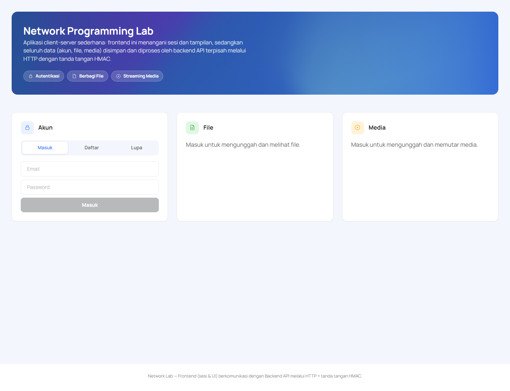

# Network Programming Lab (PJAR)

Aplikasi **client–server** untuk tugas Pemrograman Jaringan, dibuat dengan PHP
(Zend Framework 1). Terbagi dua bagian yang berkomunikasi lewat HTTP dengan
tanda tangan **HMAC**:

- **Frontend** (repo ini) — tampilan & sesi pengguna, jalan di `:8081`.
- **Backend API** — menyimpan & memproses data (akun, file, media), jalan di `:8082`.
  Repo: https://github.com/ballinboys/tugasPJAR-BE

Data disimpan di **MySQL/MariaDB**.

## Cara Menjalankan

**Syarat:** XAMPP (PHP 8.2) + MariaDB/MySQL.

1. Buat database `networking_lab`, import `database/schema.sql` (ada di repo backend).
2. Salin `.env.example` → `.env` di kedua repo, lalu isi nilainya.
3. Jalankan 3 komponen berurutan (DB → backend → frontend):

```bash
# Backend API (dari folder backend)
cd networking-pjar-be/public
php -S 127.0.0.1:8082 index.php

# Frontend (dari repo ini) — WAJIB router.php agar CSS/JS/gambar termuat
cd public
php -S 127.0.0.1:8081 router.php
```

4. Buka browser: **http://localhost:8081**

> Di Windows tersedia `START.bat` (nyalakan semua sekaligus) dan `STOP.bat`.

## Fitur

- **Autentikasi** — daftar, masuk, logout, lupa & reset password (email Gmail SMTP).
- **Berbagi File** — upload & unduh file (csv, xlsx, xls, txt, pdf; maks 50MB).
- **Streaming Media** — upload & putar video/audio di browser (mp4, webm, mp3,
  wav, ogg) dengan dukungan HTTP Range request (seek video antar-proses).
- **Keamanan** — komunikasi frontend↔backend ditandatangani HMAC-SHA256 +
  proteksi CSRF pada form.

## Screenshot


